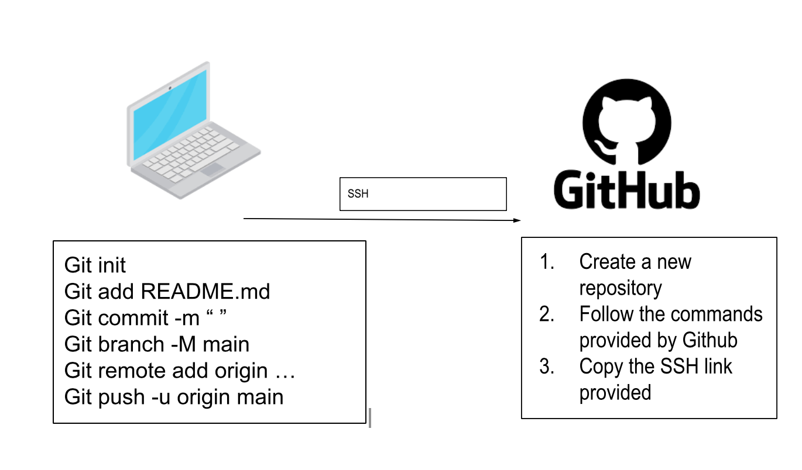

# Git & Github

### Connecting to Github using SSH




### Git Commands


##### Git init :

Used to initialise a new git repository locally you need to use the following command:
````
git init
````


##### Git Add

To add any changes in the working directory use the following command:
````
git add
````

##### Git commit

Git commit records any changes to the repository and allows you to commit a message which should be a short summary of the changes made. To save any changes to your local repository use the following command:
````
git commit
````

##### Git push origin

Git push origin is used to push all branches to the main branch
````
git push -u origin main
````

##### Git pull 

Git pull is used to update the local version of a repository from a remote.
````
git pull
````

### Deleting file/folder
git rm - rf is used to remove files or folders from a git repository. 
To delete a file in your git respository execute the rm -rf command and specify the file to be deleted

### Creating a repo on Github and making it available on localhost

**Step 1:** 
Create a new repository on Github 

**Step 2:** Open a new terminal and enter the following commands:
````
cd - change directory
mkdir <repo name> - make directory allows you to create a new directory/folder
````
**Step 3:** `nano README.md` to create a readme file

**Step 4:** `cat README.md` to check if you have created the readme

**Step 5:** Then follow the commands provided by Github


